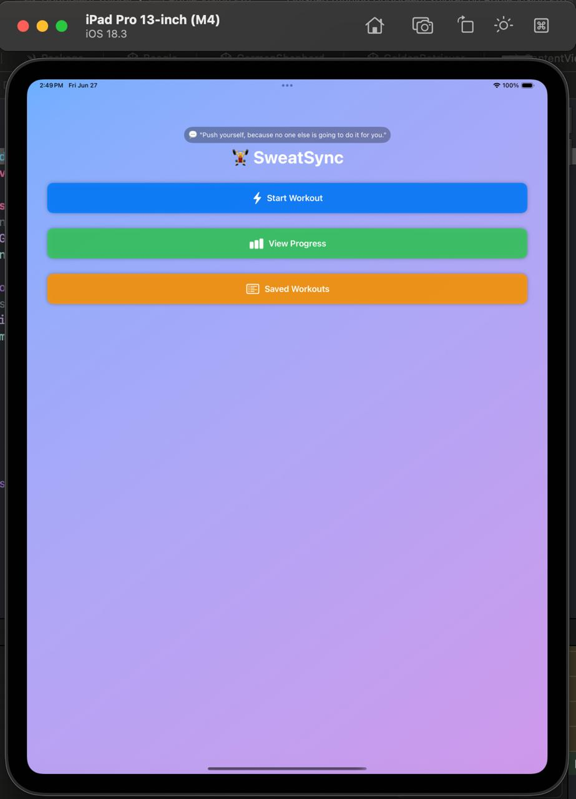
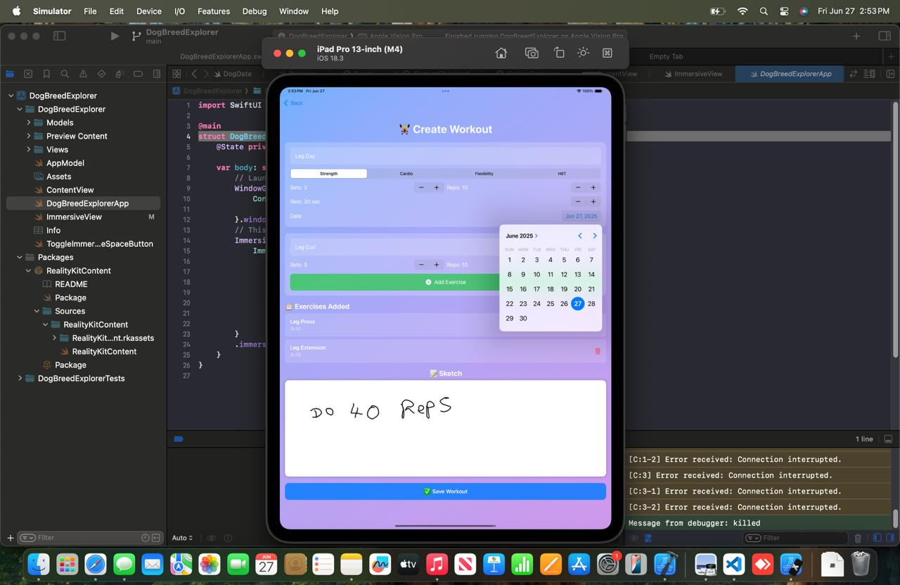
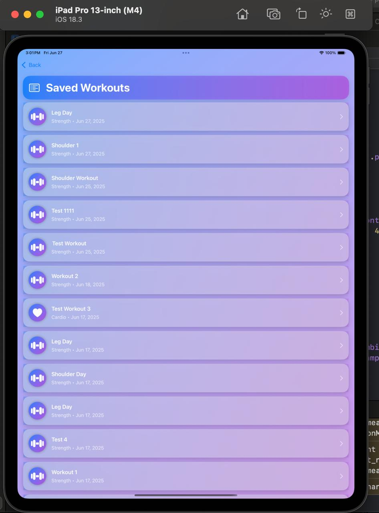
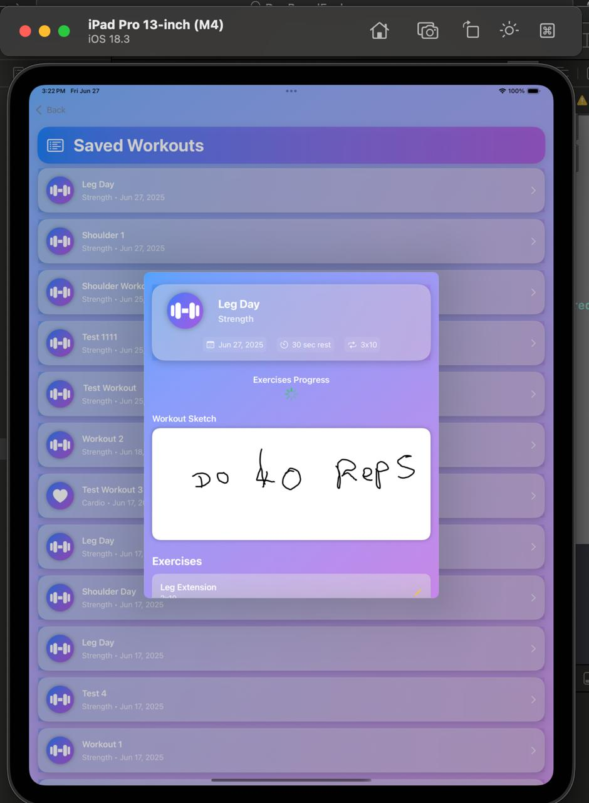
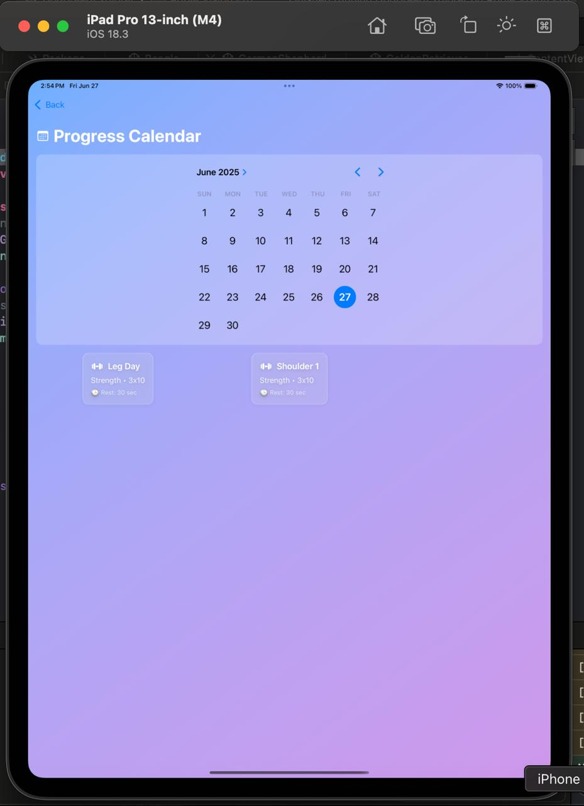
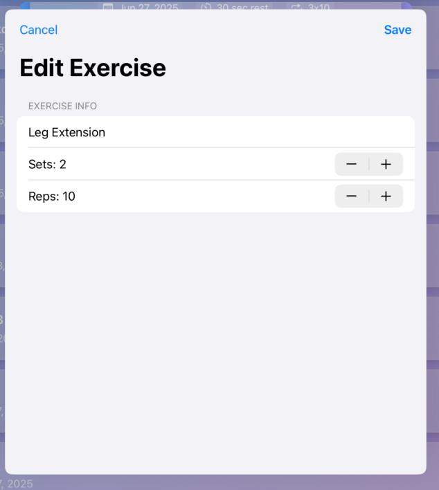
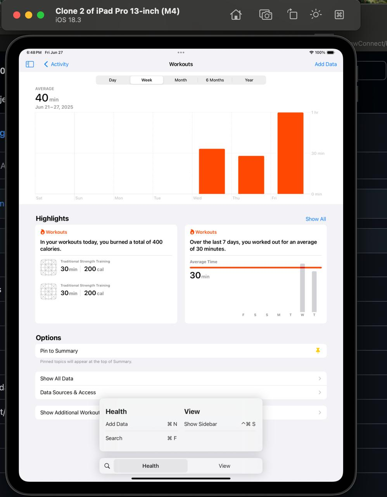

# SE4020 - Assignment 01 - Part A


# Project Name - SweatSync Workout Planner
# Student Id - IT21234484
# Student Name - Jayasinghe P.T.

#### 01. Brief Description of Project - 
SweatSync is an iPadOS fitness companion application that allows users to plan, record, and track their workouts. Users can create workouts by specifying their details, add exercises, sketch workout diagrams with Apple Pencil, and save sessions with persistent storage. HealthKit integration saves workouts directly to the Health app.
#### 02. Users of the System - 
- Fitness enthusiasts  
- Personal trainers  
- Gym-goers  
- People maintaining home workout plans

---

#### 03. What is unique about your solution -
SweatSync integrates:
- **Apple HealthKit** to save workouts  
- **PencilKit** to allow users to sketch plans or diagrams  
- A clean SwiftUI interface with Core Data for persistent storage  
- Detailed workout tracking with exercises, sets, reps, rest times, and sketches  
- Seamless data flow from creation to visualization

---

#### 04. What are the new features you have included in this Mobile App compared to Assignment 01

- Sketching workouts using PencilKit  
- HealthKit workout saving  
- Core Data to persist workouts and exercises  
- Dynamic progress calendar  
- Context menu support to delete workouts  
- Edit functionality for exercises  

---


#### 05. What are the platform specific features that you have incorporated

- **PencilKit**: for sketching workout diagrams  
- **HealthKit**: to store workout summaries  
- **Core Data**: iPadOS built-in persistence  
- **SwiftUI NavigationStack**: for modern iPadOS navigation

---
#### 06. What are the advanced library integrations you are using

- **HealthKit** (advanced Apple framework to save workouts to the Health app)  
- **PencilKit** (advanced Apple framework for drawing/sketching)

---
#### 07. Briefly document the functionality of the screens you have (Include screen shots of images)
- **HomeView**  

  Features motivational quotes, and 3 navigation buttons: *Start Workout*, *View Progress*, *Saved Workouts*.
- **WorkoutPlannerView**  

  Lets the user plan a workout, add exercises, sketch, and save. Uses PencilKit for sketches.
  
- **WorkoutListView**  

  Shows all saved workouts in a scrollable list with options to delete or open workout details.
  
- **WorkoutDetailView**  

  Displays a workout’s details, the sketch, and exercises with edit/delete capabilities.
  
- **ProgressCalendarView**  

  Allows the user to select a date on a calendar and view workouts for that date.

- **EditExerciseView**  

  Enables editing an exercise’s name, sets, and reps.

 
IOS Health App integration through HealthKit

#### 08. Give examples of best practices used when writing code
- Consistent Swift naming conventions  
- Used MVVM pattern with `WorkoutViewModel`  
- Modularized SwiftUI views  
- Used Constants where possible  
- Followed SwiftUI’s @State, @ObservedObject, @Environment best practices  
- Used `contextMenu` and swipe actions for clear user affordances  
- Applied error handling when saving Core Data contexts and HealthKit saves  
- Used `NSPredicate` with `FetchRequest` to correctly fetch linked Core Data relationships

```
 struct ExerciseModel: Identifiable {
    let id = UUID()
    var name: String
    var sets: Int
    var reps: Int
}
```
This struct is consistently named, uses Swift structures, and is easy to test.


#### 09. UI Components used

-NavigationStack
-VStack, HStack, ScrollView
-DatePicker
-ProgressView
-LazyVGrid
-Form (EditExerciseView)
-Stepper
-Button
-Context menus
-PencilKit (PKCanvasView via SketchView)

#### 10. Testing carried out


- **Manual testing:**

-Created multiple workouts with different dates
-Added, edited, and deleted exercises
-Verified HealthKit saves
-Checked sketches persisted and displayed correctly

- **Automated tests:**

-Added SweaySyncV2Tests with basic XCTest setup
-You can extend this with tests for the WorkoutViewModel using in-memory Core Data (recommendation).

```
func testAddWorkout() throws {
    let viewModel = WorkoutViewModel(context: PersistenceController.preview.container.viewContext)
    viewModel.addWorkoutWithSketch(
        name: "Test Workout",
        type: "Strength",
        sets: 3,
        reps: 10,
        rest: 30,
        date: Date(),
        exercises: [],
        sketch: PKDrawing()
    )
    XCTAssertTrue(viewModel.workouts.count > 0)
}
```

#### 11. Documentation 

(a) Design Choices

-Used MVVM for separation of data logic

-Used SwiftUI’s navigation patterns

-Integrated HealthKit and PencilKit for a modern, iPadOS-specific experience

(b) Implementation Decisions

-Used Core Data to persist workouts

-Used relationships between WorkoutEntity and ExerciseEntity

-Used a sketch saved as Data inside Core Data

-Used ProgressCalendarView for intuitive progress browsing

(c) Challenges

-PencilKit drawing not updating in PKCanvasView initially

-HealthKit entitlements requiring careful setup

-Managing Core Data relationships with exercises and sketches

#### 12. Reflection

- **Challenges:**

-Testing HealthKit features on simulator

-Sketch data persistence

-UI bugs related to ProgressCalendar date selection

- **What I’d do differently:**
  
-Start HealthKit entitlement setup earlier

-Modularize the sketch code even more

-Add more unit tests from the beginning

-Test on a physical device with HealthKit enabled


#### 13. AI Usage Documentation

**Prompt 1 (“I am building an iPadOS workout planner app. How can I store PencilKit sketches with Core Data?”)**

```
workout.sketchData = sketch.dataRepresentation()

if let data = workout.sketchData,
let drawing = try? PKDrawing(data: data) {
SketchView(drawing: .constant(drawing))
}
```
---
**Prompt 2 (“How can I add HealthKit workout saving to my app?”)**

```
let workout = HKWorkout(
activityType: .traditionalStrengthTraining,
start: startDate,
end: endDate,
duration: duration,
totalEnergyBurned: HKQuantity(unit: .kilocalorie(), doubleValue: calories),
totalDistance: nil,
metadata: [HKMetadataKeyIndoorWorkout: true]
)

healthStore.save(workout) { success, error in
if success {
print("✅ Workout saved to Health app")
}
}

yaml
Copy
Edit

```
**Prompt 3 (“My PKCanvasView is blank, how can I make it draw properly in SwiftUI?”)**

```
struct SketchView: UIViewRepresentable {
@Binding var drawing: PKDrawing

swift
Copy
Edit
func makeUIView(context: Context) -> PKCanvasView {
    let canvas = PKCanvasView()
    canvas.tool = PKInkingTool(.pen, color: .black, width: 5)
    canvas.isOpaque = false
    return canvas
}

func updateUIView(_ uiView: PKCanvasView, context: Context) {
    uiView.drawing = drawing
}
}
```

  

